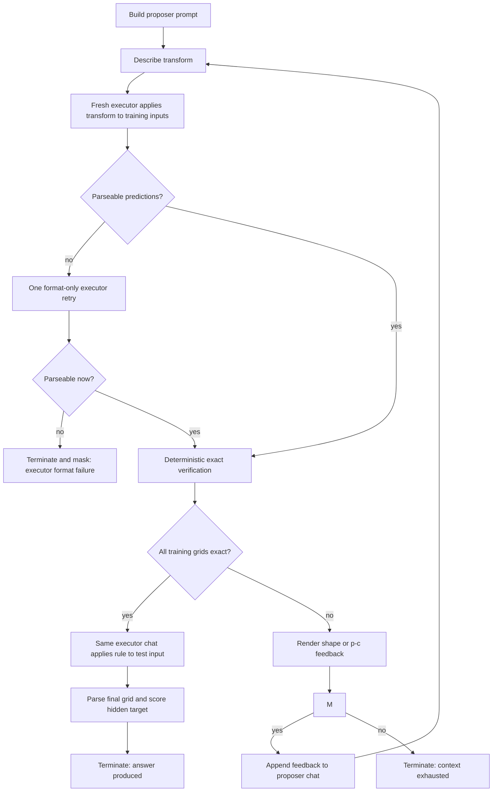

# Verifier-Guided Multi-Turn ARC-AGI

## Status

Stages 1-3 are implemented and verified: pure verifier/state logic, the mocked dual-history NeMo-Gym
agent, and the oracle-description executor benchmark. Four-GPU Megatron job 6321951 completed all 150
cases but failed the executor gate at 12% episode reliability and 56% train-format validity. Stage 4
executor training is required before an end-to-end trial.

## Motivation

The existing ARC-AGI environment asks one model response to infer a rule, mentally test it, and emit the test grid. A worked one-shot example caused strong semantic anchoring without improving real ARC exact match. The next approach should replace the model's narrated self-check with an actual check against the known training pairs.

The proposed episode separates two skills:

1. **Rule induction:** describe the transformation represented by the paired training grids.
2. **Rule execution:** apply that textual description to a grid without seeing the expected output.

A deterministic verifier compares the executed training outputs with the ground truth. Failed applications become feedback for another rule-induction turn. The test grid is executed only after the current rule passes every training pair.

This design is inspired by the neighboring `../arc_agi` solver. That solver generates executable Python transforms, runs them on the training inputs, ranks candidates by training-example exactness and then cell accuracy, and sends failed outputs back through a revision tree. This design keeps the execute-and-verify principle but deliberately tests textual transforms instead of Python programs.

## Goals

- Use exact execution on the training pairs instead of an in-context claim that a rule was checked.
- Keep rule induction and rule execution in different chat histories.
- Never reveal a training output to the executor or a hidden test output to any model call.
- Provide precise, deterministic cell feedback when a predicted training grid is wrong.
- Continue revisions until success or until another complete proposer turn would exceed the context window.
- Preserve a complete, inspectable episode trace even when only part of it is used for policy loss.
- Measure and, if necessary, train rule execution independently before relying on it as a verifier.

## Non-goals

- Generating or executing arbitrary Python as the transform representation.
- Searching a beam of rules in the first implementation. GRPO generations already provide independent rule trajectories for a prompt.
- Adding few-shot solved ARC grids to the prompt.
- Launching a new GPU experiment as part of the design phase.
- Solving credit assignment across multiple disjoint chat histories in the first implementation.

## Conversation topology

Each episode uses one persistent proposer chat and one fresh executor chat per revision round.

```text
Persistent proposer chat
  user:      training pairs, test input, rule-description contract
  assistant: transform description v0
  user:      deterministic verification feedback for v0
  assistant: transform description v1
  user:      deterministic verification feedback for v1
  ...

Fresh executor chat for round r
  user:      transform description vr + training inputs (no training outputs)
  assistant: predicted training outputs
  [only when all predictions pass]
  user:      test input(s)
  assistant: final test output(s)
```

The executor chat is discarded after a failed round. A revised description always starts a new executor chat, so an earlier prediction cannot anchor application of the new rule. The proposer sees the normal ARC test input because it can help disambiguate the intended rule, but it is never shown the test output. The executor does not see the test input until the training gate passes.

For a task with several training or test grids, one executor call handles all training inputs for the round and one follow-up handles all test inputs. A per-grid executor mode can be added if aggregate prompts prove unreliable, but it multiplies inference calls and is not the initial default.

## Episode state machine



The agent also has a high emergency round cap to stop implementation bugs. Normal termination is governed by the token budget, not by that cap.

## Prompt contracts

### Proposer prompt

The initial proposer prompt contains:

- the ARC color-to-integer mapping;
- every paired training input and output;
- the test input, clearly marked as not yet to be executed;
- a request for a general operational description, not a test answer;
- an output contract containing exactly one `<transform_description>` block.

The description should identify, when applicable:

- which objects or cells are selected;
- the operation and its order;
- how positions, colors, or output shape are determined;
- exceptions and stopping conditions;
- how the rule generalizes beyond the displayed grids.

It must not emit Python or a predicted test grid. Detailed private reasoning is not part of the interface; the artifact consumed by the executor is the explicit transformation description.

### Executor prompt

The executor receives only:

- the current `<transform_description>` text;
- numbered input grids;
- the color mapping and strict grid schema;
- a requirement to apply the supplied rule, not infer a different rule;
- a strict JSON object inside `<predictions>` tags.

For example:

```text
<predictions>
{"train_0": [[0, 2], [2, 0]], "train_1": [[1, 1], [0, 0]]}
</predictions>
```

The expected outputs are absent. The executor should return grids only, without explanations. If the training predictions pass, the follow-up test request uses `<answers>` with `test_0`, `test_1`, and so on.

### Revision prompt

The verifier appends a machine-generated report to the persistent proposer chat. It asks for a complete replacement description, not a patch or a test answer. The report distinguishes:

- parse/format failure;
- output-shape mismatch;
- cell mismatch;
- inconsistent executor results if an optional confirmation application is enabled.

The proposer already saw the expected training outputs, so the diff reveals no target information that was not present in its first prompt. The executor never receives the report.

## Deterministic verification and feedback

A valid grid is a non-empty rectangular list of lists whose cells are integers from 0 through 9. Keys must exactly match the requested input IDs. Extra prose, missing grids, ragged rows, booleans, and out-of-range values are invalid.

For equal shapes, render every cell as `p-c`, where `p` is the predicted value and `c` is the correct value. Including matching cells as, for example, `2-2` preserves alignment and follows one unambiguous format:

```text
Example train_1: mismatch
Diff (predicted-correct):
0-0 2-3 0-0
4-4 4-4 1-1
```

If shapes differ, do not construct a cell diff:

```text
Example train_1: shape mismatch; predicted 2x3, correct 3x3.
```

If prediction parsing fails, retry the executor once with only a format correction. This retry must not alter the transform description. A second failure is recorded as an executor failure rather than falsely diagnosing the rule.

Semantic executor mistakes are more dangerous: a correct description could be rejected because it was applied incorrectly. During initial evaluation, optionally repeat a mismatching application with the same description and deterministic sampling. If the two applications disagree, label the executor as unstable and ask the proposer to make the description more operational; retain both results in the trace. Do not silently choose whichever prediction is closer to the target.

## Context-window policy

The custom agent owns the turn limit in the NeMo-Gym path. It should proactively budget the proposer thread rather than waiting for vLLM to reject an oversized request.

Before starting another revision, require:

```text
current_proposer_tokens
+ next_feedback_tokens
+ reserved_proposer_output_tokens
+ chat_template_margin
<= model_context_limit
```

The initial task and all prior proposer turns remain in the chat. The first implementation does not summarize or delete failed rounds because lossy compaction would change the experiment. Executor chats are fresh, so their prior tokens do not consume the next executor's context. A final test-execution allowance is reserved separately once the training gate passes.

Termination reasons must distinguish `train_verified`, `context_exhausted`, `executor_format_failure`, `executor_context_exhausted`, and `agent_error`.

## Integration choice

### Recommendation: custom NeMo-Gym agent and resources server

NeMo-Gym is the better initial fit because its agent controls model calls and can deliberately maintain two chat histories. The proposed components are:

- `arc_transform_refinement_agent`: owns the state machine and calls the policy model for proposer and executor turns;
- `arc_agi` resources server: owns task state, training targets, hidden test targets, parsing, exact comparison, diff rendering, and metrics;
- ARC NeMo-Gym dataset rows: provide `responses_create_params`, public puzzle fields, and verifier-only expected fields through the seeded session;
- the existing NeMo-RL `NemoGym` actor: streams completed rollouts into async GRPO.

The proposer and executor model references point to the same policy model initially, but use different system prompts and histories. Keep the references separate in configuration so a frozen executor can be substituted if shared-policy updates make execution reliability drift. When they share a checkpoint, rerun the oracle-description benchmark during proposer training rather than assuming executor competence remains fixed.

`workplace_assistant_simple_agent` is useful as a composition example: its environment config binds a resources server, a policy model, a dataset, and an agent. Its actual loop is a tool-call loop, however, and does not provide the dual-history ARC protocol. `proof_refinement_agent` is a closer verify/correct example, but ARC still requires a dedicated agent because it has a persistent proposer thread plus disposable executor threads and two different output parsers.

| Capability | Native multi-turn | Existing simple agent | Proposed ARC agent |
| --- | --- | --- | --- |
| Persistent proposer history | Yes | Yes | Yes |
| Fresh nested executor chat | No standard interface | No | Yes |
| Deterministic grid verifier | Custom `env.step()` | Resource tool/verify only | Dedicated resources server |
| Two model roles/prompts | Requires rollout changes | No | Yes |
| Async GRPO integration | Yes | Yes, through NeMo-Gym | Yes, through NeMo-Gym |

### Why the native multi-turn environment is not the first choice

The native `EnvironmentInterface.step()` path naturally appends environment feedback to one message log, as shown by the sliding-puzzle environment. It does not give the environment a standard way to ask the policy for an additional fresh chat between proposer turns. Implementing the requested topology there would require either simulating the executor inside the proposer conversation or adding a specialized nested-generation interface to the native rollout code. Both are larger changes than a custom NeMo-Gym agent.

Native multi-turn remains attractive if the separate-chat requirement is later removed.

## Trainable trajectory contract

The current NeMo-Gym postprocessor represents one contiguous token history per rollout. Fresh executor chats are intentionally disjoint, so their generations cannot all be concatenated into that history without violating the token-prefix invariant.

The first implementation therefore returns:

- **trainable response:** only the final proposer generation for the episode, with its complete proposer history represented as prompt tokens;
- **audit data:** every proposer call, executor call, parsed grid, diff, token count, and state transition in the full result;
- **episode answer:** the final executor grid in structured verifier fields;
- **reward:** deterministic verifier reward associated with the final proposer generation.

This final-turn-only view also avoids positively reinforcing an early description that was proven wrong merely because a later revision recovered. A configurable all-proposer-turn view can be evaluated later, but it has coarse terminal credit assignment. Executor generations are not policy-loss tokens in this workflow.

If an episode ends without any semantic verification because the executor repeatedly violated its output format, the agent failed, or executor confirmations were inconsistent, mark the sample for loss masking instead of assigning a negative proposer reward. Context exhaustion after valid verification is a real behavioral outcome and should not be masked.

Training every disjoint executor segment as part of the same episode would require a new multi-segment trajectory abstraction or separate child rollouts. That is explicitly deferred.

## Executor competence gate

Rule execution is a prerequisite, not an assumption to hide inside end-to-end reward. Before proposer RL, build an oracle-description benchmark from the synthetic ARC rule generator:

1. Render a canonical textual description from the sampled rule and parameters.
2. Give that description and unseen inputs to a fresh executor chat.
3. Score format validity, shape match, cell accuracy, and exact grid match.
4. Split by rule family, grid size, composition depth, and description paraphrase.

The go/no-go metric is episode-level application reliability: the fraction of tasks for which an oracle description is executed exactly on **all** training inputs and then on the test input. Per-grid accuracy can look acceptable while the probability of passing several training grids is too low.

Proceed to end-to-end proposer RL only when oracle descriptions pass the full gate reliably on the intended curriculum. A provisional target is at least 95% end-to-end oracle execution with negligible format failures; the first benchmark should determine whether this threshold is realistic. If the gate fails, train the executor separately before changing the proposer workflow.

### Separate executor training task

Each executor-training sample contains a textual transform, one or more input grids, and hidden expected grids. The model returns strict grids and receives:

- dominant exact-grid reward;
- smaller shape, cell, and format components for learning signal;
- no reward for inventing or revising the transform.

Use canonical descriptions for initial competence, then add paraphrases and held-out compositions so the executor does not memorize one template vocabulary. This environment produces a normal single-history trajectory, so its executor tokens can be trained without changing NeMo-RL's trajectory representation.

## End-to-end reward

The terminal objective remains exact match on the hidden test output. Diagnostic or shaping components may include:

- final test exact match;
- whether all training pairs were verified;
- best training-pair exact fraction across rounds;
- best cell accuracy across shape-compatible failures;
- format validity;
- context exhaustion and rounds used.

Test exactness must dominate the maximum combined shaping reward so a verified but non-generalizing rule cannot outrank a correct test answer. Turn penalties, if used, should be small: recovery is the behavior this environment is intended to teach.

For GRPO, start with a scalar aggregate and log the components. Named reward components can later support GDPO, but they do not by themselves solve per-turn credit assignment.

## Few-shot transform descriptions

The `REASONING_PART` prompt in `../arc_agi/src/prompts/prompts.py` contains four useful examples of precise transform descriptions: size-conditioned hole filling, intersection of separated subgrids, size-conditioned filling of outlined regions, and moving an object toward an obstacle. They are abstract prose rules, not solved input/output grids, so they are safer than the discarded one-shot puzzle.

They can still introduce semantic bias. Negative wording alone did not prevent anchoring in the prior experiment. Therefore:

- keep transform-description examples behind `few_shot_count` and `few_shot_seed`;
- never include a full solved ARC grid as a style example;
- sample or rotate examples rather than fixing one rule for every task;
- include them only in the proposer prompt, never in executor prompts;
- log the selected example IDs and measure transform-term copying;
- establish a zero-example baseline before attributing an improvement to them.

The initial plumbing test should use zero few-shot examples. The first prompt ablation should compare zero against a small randomized set of abstract descriptions.

## Data and state

Conceptually, a seeded task contains:

```text
task_id
train: [{input, output}, ...]
test:  [{input, hidden_output}, ...]
prompt_variant and few-shot IDs
```

Episode state contains:

```text
round index and termination reason
proposer history
description for each round
executor request/response for each round
parsed predictions and verification records
final answers
per-role token usage and latency
```

Hidden test outputs remain in the resources-server session and must never be serialized into a model request. Full-result logging may contain expected values for offline audit, but normal W&B full-result tables should remain disabled because these traces are large.

## Metrics and traces

At minimum, emit:

- `train_gate_pass`, `test_exact`, and test cell accuracy;
- exact training pairs per round and best fraction reached;
- proposer/executor format-valid and shape-match rates;
- rounds used and termination-reason counts;
- proposer, executor, and feedback tokens separately;
- executor disagreement rate when confirmation is enabled;
- oracle-description execution reliability;
- rule-description and few-shot term-copy rates;
- wall time per role and per episode.

Save representative complete traces containing the initial prompt, each proposer response, each isolated executor request/response, verifier feedback, final answer, and reward. The trace should explicitly label which tokens entered policy loss.

## Failure modes

| Failure | Consequence | Mitigation |
| --- | --- | --- |
| Correct rule, incorrect execution | Valid rule is revised or rejected | Oracle executor gate, deterministic sampling, format retry, optional mismatch confirmation, separate executor training |
| Proposer patches examples instead of learning a rule | Training gate passes but test fails | General-description contract, multiple training pairs, hidden test output, exact test reward |
| Few-shot semantic anchoring | Descriptions copy the example family | Zero-shot baseline, randomized abstract examples, copy metrics |
| Context consumed by full diffs | Too few useful revisions | Fresh executor chats, proactive token accounting, compact fixed diff syntax |
| Positive reward trains earlier bad turns | Incorrect rules are reinforced | Final-proposer-turn-only training view |
| Disjoint chats are concatenated as one trajectory | Token-prefix assertion or invalid policy loss | Exclude executor chats from the end-to-end trainable response; train them separately |
| Executor returns invalid JSON | Episode fails for formatting rather than reasoning | Strict parser and one format-only retry |
| Test target leaks into a prompt | Invalid evaluation | Resources-server ownership and tests that scan every model request |

## Implementation and evaluation sequence

1. **Pure logic — implemented:** parsers, exact comparison, `p-c` diffs, shape mismatch, state transitions, token budgeting, and leakage guards live in `3rdparty/Gym-workspace/Gym/resources_servers/arc_agi/logic.py` and are used by the session-owning ARC resources server.
2. **Mocked agent — implemented:** `arc_transform_refinement_agent` exercises persistent proposer history, fresh executor histories, one format retry, proactive context termination, complete traces, and final-proposer-only result assembly without a model server.
3. **Executor benchmark — implemented and measured:** `tools/arc_executor_benchmark.py` generates held-out unaugmented synthetic tasks, renders canonical descriptions from sampled rule parameters, gates test execution on exact training application, and reports reliability by rule family, actual grid size, composition depth, and description paraphrase. Four-GPU Megatron job 6321951 measured 18/150 reliable episodes (12%) against the 95% gate.
4. **Executor training if required:** run the separate execution task until the oracle gate is reliable.
5. **Inference-only end-to-end trial:** run a fixed ARC subset, inspect complete traces, and measure whether revisions improve the training gate and real test exactness.
6. **Small RL plumbing run:** verify on-policy token IDs, reward association, async streaming, context termination, and resume behavior.
7. **Controlled training experiment:** only after the earlier gates pass, prepare an exact preflight and request authorization for the next multi-node run.

The fixed 172-row real ARC-AGI-2 validation subset remains the campaign's authoritative metric. Synthetic exactness and executor reliability are prerequisites and diagnostics, not substitutes for real ARC exact match.

Run the stage-3 measurement against an OpenAI-compatible chat-completions endpoint from a compute node:

```bash
uv run tools/arc_executor_benchmark.py \
  --base-url http://127.0.0.1:10240/v1 \
  --model <served-model-name> \
  --output reports/arc_executor_benchmark.json
```

The default benchmark uses 150 deterministic held-out tasks across levels 1-5 and all three description
paraphrases. It records complete audit traces in the output file. The provisional go/no-go gate remains 95%
episode reliability and at least 99% format validity for both training applications and attempted test
applications.

## Open questions

- Should a semantic mismatch always be confirmed by a second executor call, or only while measuring executor reliability?
- Does showing the test input to the proposer improve disambiguation enough to justify the added temptation to solve prematurely?
- Is final-turn-only training sufficient to learn effective revisions, or is per-turn return-to-go/loss masking needed?
- How much proposer feedback can be omitted without harming correction quality?
- Should the executor handle all training grids in one call or use isolated per-grid calls for difficult/large tasks?
- Once the single-path loop works, does selecting among several independently proposed descriptions improve generalization enough to justify the extra inference?

## References

- [NeMo-Gym integration](nemo-gym-integration.md)
- [Native sliding-puzzle multi-turn guide](../guides/grpo-sliding-puzzle.md)
- [`workplace_assistant_simple_agent` composition](../../3rdparty/Gym-workspace/Gym/environments/workplace_assistant/config.yaml)
- [`proof_refinement_agent` verify/correct loop](../../3rdparty/Gym-workspace/Gym/responses_api_agents/proof_refinement_agent/app.py)
- [Upstream ARC solver](https://github.com/jerber/arc_agi)
- [Upstream prompt definitions and `REASONING_PART`](https://github.com/jerber/arc_agi/blob/main/src/prompts/prompts.py)
